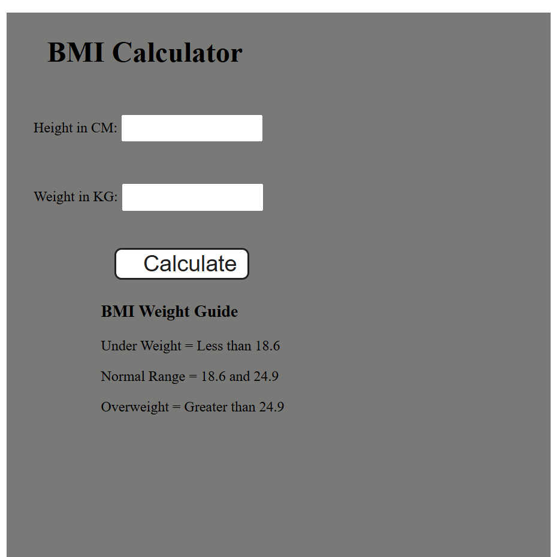

# 🧮 BMI Calculator

A simple and responsive BMI (Body Mass Index) calculator built using **HTML**, **CSS**, and **JavaScript**.  
It allows users to input their height (in cm) and weight (in kg) to calculate their BMI and shows the corresponding weight category.

---

## ✨ Features

- Enter **Height (cm)** and **Weight (kg)** to calculate BMI.
- Displays BMI result instantly.
- Shows BMI weight guide:
  - **Underweight**: Less than 18.6
  - **Normal Range**: 18.6 – 24.9
  - **Overweight**: Greater than 24.9
- Clean, minimal UI with easy-to-read results.

---

## 🚀 Technologies Used

- **HTML5** for structure  
- **CSS3** for styling  
- **JavaScript** for BMI calculation logic  

---

## 🖥️ How to Use

1. Clone this repository:
   ```bash
   git clone https://github.com/ankitaThorve/BMI-calculator.git
   ```
2. Navigate to the project folder:
    ```bash
    cd bmi-calculator
    ```
3. Open index.html in your browser.
4. Enter your height (cm) and weight (kg) and click on Calculate to see your BMI result.

   ---
  ## 📷 Screenshot
   
   

   ---

  ## 📚 BMI Formula
  ```ini
     BMI = weight (kg) / (height (m) * height (m))
  ```

    ---

  ## 🧑‍💻 Author

   - [Ankita Thorve](https://github.com/ankitaThorve)
